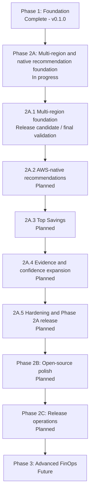

# BudgetBeagle Future Development Plan

[Project README](README.md)

This document is the long-term public roadmap and contributor handoff for BudgetBeagle. README.md remains the concise public overview; both files must stay synchronized whenever phase status, roadmap order, supported services, schema versions, release status, branch workflow, or major feature availability changes.

## Current Project Status

| Area | Status | Notes |
| --- | --- | --- |
| Stable release | v0.1.0 | Phase 1 foundation release. |
| Phase 1 | Complete | Deterministic AWS cost-detection foundation is released. |
| Phase 2A | In progress | Multi-region and native recommendation foundation. |
| Phase 2A.1 | Release candidate / final validation | Implementation and recovery fixes are committed and pushed on `phase2a-multiregion-native-recommendations`; CI and final real-AWS validation must pass before merge. |
| Phase 2A.2 | Planned | AWS-native recommendation adapters; not started. |
| Phase 2A.3 | Planned | Top Savings and prioritization surface; not started. |
| Phase 2A.4 | Planned | Expanded evidence and recommendation confidence; not started. |
| Phase 2A.5 | Planned | Phase 2A hardening and release wrap-up; not started. |
| Phase 2B | Planned | Open-source polish and contributor readiness. |
| Phase 2C | Planned | Release operations and hosted-readiness groundwork. |
| Phase 3 | Future | Advanced FinOps capabilities. |

## Priority Stars

| Priority | Meaning |
| --- | --- |
| ***** | Required before the next release or merge gate. |
| **** | High-value milestone work once the current gate is clear. |
| *** | Important roadmap item with moderate sequencing flexibility. |
| ** | Useful polish or expansion after core workflows are stable. |
| * | Future exploration; do not start until higher-priority phases are done. |

## Roadmap Overview

## Phase 1 Completed - v0.1.0

Status: Complete and released.

Delivered scope:

- Local FastAPI + React application with JWT authentication.
- Read-only AWS scanning for EC2, EBS, RDS, S3, load balancers, Elastic IPs, NAT Gateways, and CloudWatch evidence.
- Deterministic cost rules with optional AI wording only after backend validation.
- Canonical report schema, saved history, confidence labels, pricing status, and export redesign.
- ZIP export with CSV files and sanitized JSON report output.
- Local launcher, Docker option, and documentation foundation.

## Phase 2A - Multi-Region And Native Recommendation Foundation

Status: In progress.

### Phase 2A.1 - Multi-Region Scanning Foundation *****

Status: Release candidate / final validation.

Implementation state:

- Single-region compatibility, selected-regions mode, and all-enabled-regions mode are implemented.
- Enabled-region discovery uses `ec2:DescribeRegions` with structured safe errors.
- Bounded multi-region orchestration is implemented.
- Partial regional failures are visible in reports and exports.
- Global-once S3 scanning and Cost Explorer billing are not duplicated per region.
- Regional service telemetry records attempted, completed, and failed services; zero-resource services count as completed when checked successfully.
- `regions.csv` exports blank error fields for successful regions.
- `legacy_primary_region` documents compatibility-only singular region behavior.
- Export sanitization removes `account_id_raw` and recursively masks full account IDs.
- Billing global aliases are normalized into one `Global / No Region` row.
- Weighted progress is labeled `Overall progress`.
- Recovery fixes are committed and pushed on `phase2a-multiregion-native-recommendations`.

Remaining before marking complete:

- GitHub Actions must pass for the latest release-candidate commit.
- Final two-region real-AWS validation must pass using `ap-northeast-1` and `ap-southeast-1`.
- Exports must be manually reviewed for account ID leakage.
- Regional service telemetry, billing totals, S3 attribution, history reload, cancellation, and browser refresh behavior must be manually verified.
- Pull request must be reviewed and merged into `main`.

Do not start Phase 2A.2 until Phase 2A.1 is merged or the maintainer explicitly changes the plan.

### Phase 2A.2 - AWS-Native Recommendations ****

Status: Planned, not started.

Planned scope:

- Integrate AWS Compute Optimizer only through the existing recommendation adapter boundary.
- Integrate AWS Cost Optimization Hub only after adapter behavior and permissions are reviewed.
- Normalize native AWS recommendations into BudgetBeagle categories, evidence, confidence, region/scope metadata, and savings semantics.
- Preserve deterministic backend validation; native recommendations must not bypass safety rules.

Explicit non-goals before this phase starts:

- No live Compute Optimizer calls.
- No live Cost Optimization Hub calls.
- No automatic remediation.

### Phase 2A.3 - Top Savings And Prioritization ****

Status: Planned, not started.

Planned scope:

- Add a Top Savings report surface that ranks actionable findings by evidence-backed savings.
- Keep observations separate from actionable items.
- Surface confidence, pricing status, affected regions, and action risk in the ranking.
- Preserve `Not enough data` semantics when savings are not numeric.

### Phase 2A.4 - Evidence And Confidence Expansion ***

Status: Planned, not started.

Planned scope:

- Expand evidence summaries for region-aware findings.
- Improve service-level confidence explanations.
- Add clearer permission and data-gap guidance.
- Keep AI wording constrained to validated backend data.

### Phase 2A.5 - Phase 2A Hardening And Release Wrap-Up ***

Status: Planned, not started.

Planned scope:

- Finalize Phase 2A documentation.
- Expand regression coverage for native recommendations and Top Savings.
- Complete release notes for the Phase 2A milestone.
- Prepare the next stable release once CI and manual validation pass.

## Phase 2B - Open Source Polish

Status: Planned, not started.

### Phase 2B.1 - Contributor Experience ***

- Improve contributor setup instructions.
- Keep issue and PR templates aligned with safety and documentation rules.
- Clarify local test, build, Docker, and launcher workflows.

### Phase 2B.2 - CI/CD And Quality Gates ****

- Keep backend tests, frontend typecheck/tests/build, Docker config, and launcher smoke checks in CI.
- Add coverage and lint gates only where they improve signal without blocking normal contribution flow.
- Keep GitHub Actions required before release-candidate PRs are merged.

### Phase 2B.3 - Public Project Hygiene ***

- Add or refine license, security policy, changelog, release notes, and support expectations.
- Keep screenshots and examples sanitized.

## Phase 2C - Release Operations And Hosted-Readiness Groundwork

Status: Planned, not started.

### Phase 2C.1 - Release Process ***

- Define version tagging, release notes, rollback expectations, and branch protection rules.
- Keep `main` stable and release-ready.

### Phase 2C.2 - Deployment Readiness **

- Improve Docker and environment documentation.
- Clarify production database, secret management, and CORS expectations.
- Do not introduce hosted account mutation behavior.

### Phase 2C.3 - Operational Observability **

- Improve structured logs without leaking secrets or account IDs.
- Add actionable diagnostics for failed scans, region discovery, billing permissions, and export generation.

## Phase 3 - Advanced FinOps

Status: Future. Do not start until Phase 2 gates are complete.

### Phase 3A - Tag-Based Chargeback ***

- Analyze spend and findings by tags where Cost Explorer and resource metadata support it.
- Keep missing or inconsistent tag data explicit.

### Phase 3B - Anomaly Detection ***

- Add evidence-backed anomaly surfaces for unusual spend or resource patterns.
- Avoid black-box claims without explainable evidence.

### Phase 3C - Spot And Commitment Guidance **

- Explore Spot, Savings Plans, and Reserved Instance opportunities with conservative assumptions.
- Keep recommendations review-only.

### Phase 3D - Scheduling And Idle Windows **

- Identify potential start/stop scheduling candidates from metrics.
- Never automate schedule changes without explicit future design approval.

### Phase 3E - Multi-Account And Organization Views **

- Investigate safe multi-account aggregation patterns.
- Preserve account masking and export sanitization guarantees.

### Phase 3F - Policy And Governance Insights **

- Add read-only checks for governance signals that affect cost hygiene.
- Keep security-sensitive output sanitized.

### Phase 3G - Collaboration Workflows *

- Explore assignment, comments, review status, and team handoff workflows.
- Keep local-first behavior viable.

### Phase 3H - Advanced Reporting *

- Explore scheduled reports, comparison views, and executive summaries.
- Preserve raw-data transparency and export safety.

## Execution Order

1. Finish Phase 2A.1 final validation, CI, PR review, and merge.
2. Update README.md, FUTURE_PLAN.md, docs/PHASE_STATUS.md, and docs/ROADMAP.md when Phase 2A.1 is merged.
3. Start Phase 2A.2 only after Phase 2A.1 is safely merged or the maintainer explicitly reprioritizes.
4. Complete each phase with local verification, CI, documentation sync, and manual validation where AWS behavior is involved.
5. Keep `main` stable; all active work belongs on feature or phase branches.

## Engineering Rules

- Prefer deterministic backend rules and structured data over ad hoc strings.
- Keep AI optional and constrained to wording over validated facts.
- Preserve schema compatibility for saved reports.
- Add focused tests for every bug fix and every public behavior change.
- Do not add abstractions unless they reduce real complexity or match existing patterns.
- Keep frontend controls ergonomic, dense, and report-focused.
- Keep exports UTF-8, recursively sanitized, and stable for downstream users.

## Safety Rules

- BudgetBeagle is read-only by default.
- Do not add automatic AWS mutations.
- Do not leak credentials, session tokens, full ARNs, `account_id_raw`, or full 12-digit AWS account IDs.
- Do not expose raw stack traces or raw AWS errors in user-facing output.
- Do not duplicate global/account APIs per region.
- Do not mark a phase complete before CI, documentation, and required manual validation gates pass.
- Do not start Compute Optimizer or Cost Optimization Hub work before Phase 2A.2 is explicitly active.

## Branch Strategy

- `main` remains stable and must not be modified directly.
- Phase 2A.1 release-candidate work remains on `phase2a-multiregion-native-recommendations` until reviewed and merged.
- Do not force-push or rewrite history on shared branches.
- Commit scoped changes with clear messages.
- Push only to the active feature or phase branch.
- Merge to `main` only through the agreed pull-request flow after CI and validation pass.

## Resume Checklist

When resuming work:

1. Confirm the current branch.
2. Run `git fetch origin`.
3. Check `git status`, `git log -3 --oneline`, and remote tracking.
4. Read README.md, FUTURE_PLAN.md, docs/PHASE_STATUS.md, and docs/ROADMAP.md for current status.
5. Confirm no stale generated files or credentials are staged.
6. Re-run the relevant tests and build commands before committing.
7. Keep README.md and FUTURE_PLAN.md synchronized if status or roadmap information changes.

## Definition Of Done

A milestone is done only when:

- Implementation is complete and scoped to the milestone.
- Backend tests pass.
- Frontend typecheck, tests, build, and audit pass when applicable.
- Docker config and launcher checks pass when applicable.
- GitHub Actions passes for the latest branch commit.
- Documentation is synchronized across README.md, FUTURE_PLAN.md, docs/PHASE_STATUS.md, and docs/ROADMAP.md.
- Security and export-sanitization expectations are reviewed.
- Required manual AWS validation passes for AWS-facing behavior.
- The pull request is reviewed and merged into `main` when the milestone is intended for release.
